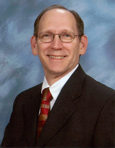
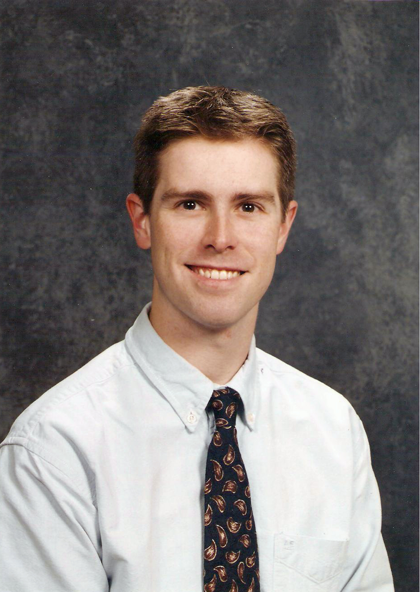

# About Us

Various missions have played important roles in the growth of our church, whether it be community outreach or service on the foreign field.  A large percentage of our families have served on short term foreign mission trips as well as supported local organizations assisting the needy

We are affiliated with the Shiloh Baptist Association, the Southern Baptist Conservatives of Virginia, and the Southern Baptist Convention.

Stevensburg Baptist Church is located in the rural community of Stevensburg, Virginia, which is five miles east of the town of Culpeper. Situated in the foothills of the Blue Ridge Mountains between Fredericksburg and Culpeper, it is just 70 miles southwest of our nation’s capital.

# Our staff
           
### Philip Walker, Pastor	

Pastor Walker is married to Cheryl Eddins Walker, a retired RN from Culpeper, VA.  They will celebrate 43 years of marriage in June 2018 and have four grown children, Stephen, Kevin, Jason and Jonathan, as well as ten grandchildren. Pastor Walker earned a BA from Bridgewater College in Bridgewater, VA and a Master of Divinity from Southwestern Baptist Theological Seminary in Fort Worth, TX.  He first served as an associate pastor at historical Capital Hill Metropolitan Baptist Church in Washington, D.C. and has been the senior pastor at Stevensburg since 1987.  He also served on the trustee board of his alma mater (SWBTS) from 1995-2005. Philip enjoys reading, fantasy football, painting and working puzzles.	

### Bruce Baxley, Youth/Associate Pastor

Bruce has been serving at Stevensburg Baptist Church since August 2009, along with his wife, Andrea.  They have been married since July 2006, have three daughters, Susanna, Julia, and Lydia.  Bruce earned a BS in Biology from Armstrong Atlantic State University in Savannah, GA in 1999 and in 2006 he earned his MA in Theological Studies from The Southern Baptist Theological Seminary in Louisville, KY.  He is currently pursuing his Master of Divinity from Liberty Baptist Theological Seminary in Lynchburg, VA.  Bruce enjoys playing sports, reading, and watching movies with his wife.
