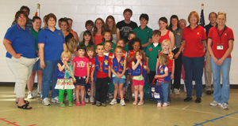
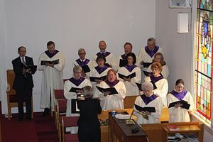
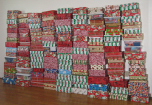
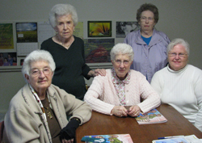

#Ministries

## Awana

The Awana ministry is designed for children and youth (ages 3 yrs through 6th grade) with the goals of evangelism
and discipleship.  Participants are divided into three clubs that meet on Sunday evenings during the school year
under the direction of their leadership teams.  Awana is centered on the Gospel and uses scripture memory as its
key element; the children also participate in large group Bible teaching and game time.

## Music

Music is an integral part of Stevensburg’s worship services.  In addition to leading the congregation in worship and praise
on Sunday mornings, the Adult Choir also prepares special musical presentations for Easter and Christmas. The Praise Team 
leads worship once a month and the Adult and Children’s Handbell Choirs perform at various times throughout the year.

## Dorcas Piecemakers

The Dorcas Piecemakers oversee the Operation Christmas Child ministry which blesses both the church and poor children
around the world.  Participants purchase needed supplies and toys and pack them in gift-wrapped shoe boxes for distribution
by Samaritan’s Purse.  The Dorcas Piecemakers also construct lap robes for the needy and crib quilts for babies at risk.

## Women on Mission

The Women on Mission are active in missions on all levels.  They gather supplies for the prison ministry, visit nursing homes
and provide birthday parties for the residents, prepare meals for volunteers at the Free Clinic, assemble items for the
Safe House,  collect contributions for the community food closet, recycle greeting cards for St. Jude’s and send seeds to
Liberia.

## Youth
The youth ministry at Stevensburg Baptist Church consists of students from 7th to 12th grades.  The youth group meets each
Wednesday for Bible Study and games, and Bible study is also available on Sunday nights during the school year.  Besides the
weekly meetings, the youth also participate in monthly events, such as lock-ins, youth rallies, concerts, trips, and various
other activities.  The goal of the youth ministry is to “present everyone mature in Christ” (Colossians 1:28) and to set an
example “in speech, in conduct, in love, in faith, and in purity” (1 Timothy 4:12).
