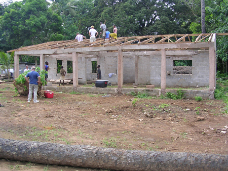

# West Africa - Guinea, Sierra Leone

Members of Stevensburg have partnered with the International Mission Board missionaries in Guinea to provide relief, 
encouragement and Bible teaching to the Susu people group there and in Sierra Leone.  They have assisted with building 
roofs on an IMB guest house and a Christian preschool, visited a prison and orphanages, taught Vacation Bible School, and
helped conduct retreats for all missionaries working with the Susu.

