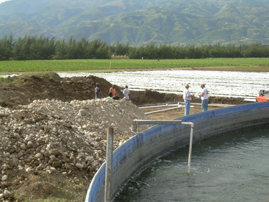

# Haiti

Stevensburg Church has sent a number of short term mission teams to Haiti where much work has been done on a medical/surgical
clinic at Operation Double Harvest.  Volunteers have also assisted with projects designed to improve life for the Haitians.
Since the earthquake in early 2010, efforts have been concentrated on medical relief and rebuilding in the Croix de Bouquets
community, which is about 30 minutes east of Port-au-Prince.

