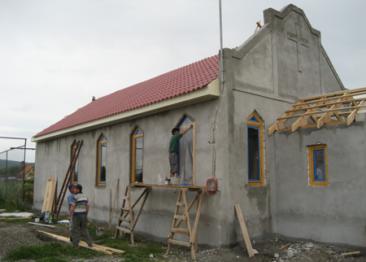

Romania

Since 1996 approximately 35 members of Stevensburg have traveled to Romania to assist the Romania Chapel Project
in building churches.  While our local congregation participates through prayer and financial support, the team members
provide leadership, work on construction, conduct Vacation Bible School for the children, participate in prayer walks, 
facilitate a women’s ministry outreach, and serve on evangelism teams.  More than 100 chapels have been built and many
Romanians have accepted Christ as their Lord and Savior.

